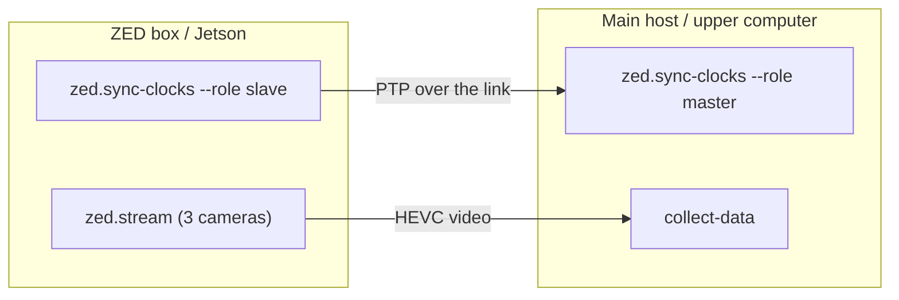

Data collection runs across **two machines** on the same network:

- **Main host** (the upper computer) — owns the dataset, runs teleop and the recording loop.
- **ZED box** (the Jetson sender) — streams the three ZED-X One cameras.

Both machines must agree on the time (via PTP) so each recorded camera frame is aligned with the joint sample taken at the same instant. Each machine therefore runs **two long-lived processes**, each in its own terminal, that stay up for the entire session.



<Warning>
  Start the clock-sync daemon on **both** machines before launching `collect-data`. If PTP isn't running, the receiver's capture/decode skew check in `ZedCamera.connect()` warns and recorded camera/joint pairs will not be time-aligned. See [`zed.sync-clocks`](/cli/zed-sync-clocks) for the PTP canary details.
</Warning>

## Network setup

The two machines must be able to reach each other over the network. Configure each NIC with an IP however you like — DHCP on a shared switch, or static IPs (e.g. `192.168.10.1/24` on the ZED box and `192.168.10.2/24` on the main host) over a direct ethernet cable. Find the ZED box's IP (`ip addr`) and pass it to the main host as `--robot_config.zed_host <zed-box-ip>`.

Interface names vary by machine — the link might be `eth0`, `enp3s0`, `eno1`, and so on. Run `ip link` (or `ip addr`) on each machine to find the interface carrying the link, and substitute it for `<iface>` in the commands below.

PTP runs over whichever interface carries the link (`zed.sync-clocks --iface`). If the two machines are not on the same L2 segment (e.g. separated by a router rather than a switch), add `--transport udpv4` to the clock-sync commands.

## Prerequisites

- The `lerobot` extra installed on the main host: `uv sync --extra lerobot` (see [Installation](/installation)).
- CAN set up on the main host ([`can.setup`](/cli/can-setup)) and motors verified ([`motor.info`](/cli/motor-info)).
- `pyzed` installed on the ZED box ([`zed.install`](/cli/zed-install)) and the three camera serial numbers on hand.
- A network link between the two machines — either a direct ethernet cable or a shared router/switch (see [Network setup](#network-setup)).

## ZED box (Jetson)

Open two terminals on the ZED box.

<Steps>
  <Step title="Start clock sync (slave)">
    ```bash
    axol zed.sync-clocks --role slave --iface <iface>
    ```

    Replace `<iface>` with the ZED box's link interface (find it with `ip link`). Leave this running for the whole session. See [`zed.sync-clocks`](/cli/zed-sync-clocks) for transport and timestamping options.
  </Step>

  <Step title="Stream the cameras">
    ```bash
    axol zed.stream \
        --overhead 12345678 \
        --left-arm 23456789 \
        --right-arm 34567890
    ```

    Streams from the NIC's current IP until `Ctrl+C`. Note that IP — you'll pass it to the main host as `--robot_config.zed_host`. See [`zed.stream`](/cli/zed-stream) for resolution, fps, and bitrate flags.
  </Step>
</Steps>

## Main host (upper computer)

Open two terminals on the main host.

<Steps>
  <Step title="Start clock sync (master)">
    ```bash
    axol zed.sync-clocks --role master --iface <iface>
    ```

    Replace `<iface>` with the main host's link interface (find it with `ip link`). The `master` role runs on the long-lived upper computer that owns the dataset. Leave it running for the whole session.
  </Step>

  <Step title="Run data collection">
    ```bash
    axol collect-data \
        --repo_id myorg/pick-place \
        --task "Pick the red cube and place it in the bin" \
        --robot_config.zed_host 192.168.1.42
    ```

    Replace `192.168.1.42` with the ZED box's IP.

    The robot is driven over VR (accept the TLS certificate first — see the [Teleoperation quickstart](/quickstart/teleop)). See [`collect-data`](/cli/collect-data) for the full field list, including `--fps`, `--teleop_hz`, stiffness, and `--push_to_hub`, and [Command configuration](/cli/configuration) for the draccus override syntax.
  </Step>
</Steps>

## Controller layout

Episodes are driven entirely from the Quest controllers. The movement controls are the same as in [teleoperation](/quickstart/teleop); data collection adds the **A** (record) and **B** (mode) buttons.


| # | Button | Action |
|---|---|---|
| 1 | Left grip | Press both grips (1 + 2) together to **enable** arm tracking; press either alone to **disable** (toggle, not hold) |
| 2 | Right grip | See above |
| 3 | Left trigger | Actuate left gripper |
| 4 | Right trigger | Actuate right gripper |
| 5 | X | **Reset** to rest pose. During a recording, stops and **discards** the take (re-record); during the start countdown, cancels it |
| 6 | A | **Record**: start a take (3-second countdown), or stop and **save** the current take |
| 7 | Y | **Exit** the VR session |
| 8 | B | Toggle between **Teleop** and **Data Collection** mode (disabled while recording or counting down) |

## Recording an episode

<Steps>
  <Step title="Enter Data Collection mode">
    Press **B** to switch from Teleop into Data Collection. You can drive the arms in either mode, but a take can only be started from Data Collection.
  </Step>

  <Step title="Start a take">
    Press **A** to begin recording — a 3-second countdown runs (the headset stays in Data Collection), then frame capture begins. Press **A** again during the countdown, or **X**, to cancel.
  </Step>

  <Step title="Finish the take">
    - Press **A** to stop and **save** the episode.
    - Press **X** to stop and **discard** it (re-record).

    While the episode is written to disk the headset enters the **Saving** state and every control except **Y** (exit) is blocked. When the write completes the headset returns to Data Collection and the arms move back to the rest pose, ready for the next take.
  </Step>
</Steps>

| Headset state | Meaning |
|---|---|
| `Teleop` | Driving the arms; recording not armed |
| `Data Collection` | Driving the arms; ready to record |
| `Recording` | Capturing frames to the dataset |
| `Saving` | Episode being written to disk; controls blocked |

Collection resumes from an existing dataset at `--root`; an aborted session that saved no episodes is cleaned up on shutdown. Press `Ctrl+C` in the `collect-data` terminal to finish.

<Note>
  The full controller bindings and headset state machine are documented in the [VR Interface](/guides/vr-interface) guide. The interface source lives in this repo under `web/`.
</Note>

<Tip>
  Prefer a browser to juggling terminals? The [web control panel](/guides/control-panel) runs both clock-sync/streaming and `collect-data` from one page — connect the ZED box once and press **Start**.
</Tip>

## Next steps

<CardGroup cols={2}>
  <Card title="Policy Inference" icon="robot" href="/quickstart/inference">
    Run a trained policy autonomously across the same two machines.
  </Card>
  <Card title="collect-data reference" icon="terminal" href="/cli/collect-data">
    Every flag and the dataset capture internals.
  </Card>
</CardGroup>
