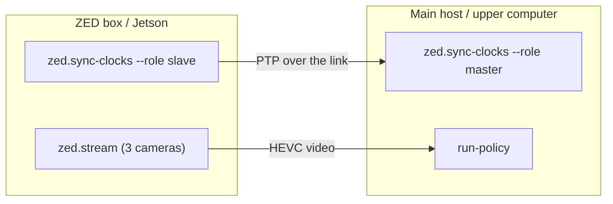

Policy inference runs across **two machines** on the same network, exactly like [data collection](/quickstart/data-collection):

- **Main host** (the upper computer) — runs the policy server and the autonomous control loop.
- **ZED box** (the Jetson sender) — streams the three ZED-X One cameras.

Both machines must agree on the time (via PTP) so the camera observations fed to the policy are aligned with the joint state. Each machine runs **two long-lived processes**, each in its own terminal, that stay up for the entire rollout session.



<Warning>
  Start the clock-sync daemon on **both** machines before launching `run-policy`. If PTP isn't running, the receiver's capture/decode skew check in `ZedCamera.connect()` warns and the observations sent to the policy will not be time-aligned with joint state. See [`zed.sync-clocks`](/cli/zed-sync-clocks).
</Warning>

## Network setup

The two machines must be able to reach each other over the network. Configure each NIC with an IP however you like — DHCP on a shared switch, or static IPs (e.g. `192.168.10.1/24` on the ZED box and `192.168.10.2/24` on the main host) over a direct ethernet cable. Find the ZED box's IP (`ip addr`) and pass it to the main host as `--robot_config.zed_host <zed-box-ip>`. This is the same setup as the [Data Collection quickstart](/quickstart/data-collection#network-setup).

Interface names vary by machine — the link might be `eth0`, `enp3s0`, `eno1`, and so on. Run `ip link` (or `ip addr`) on each machine to find the interface carrying the link, and substitute it for `<iface>` in the commands below.

PTP runs over whichever interface carries the link (`zed.sync-clocks --iface`). If the two machines are not on the same L2 segment (e.g. separated by a router rather than a switch), add `--transport udpv4` to the clock-sync commands.

## Prerequisites

- The `lerobot` extra installed on the main host — the [quick install](/installation#quick-install-recommended) includes it. For GPU inference the `cuda` extra is also needed, which the quick install does **not** include: on a development install run `uv sync --extra lerobot --extra cuda` (see [Installation](/installation)).
- A trained checkpoint (local path or HuggingFace repo) and its policy type (`act`, `smolvla`, `pi0`, …).
- CAN set up on the main host ([`can.setup`](/cli/can-setup)) and motors verified ([`motor.info`](/cli/motor-info)).
- `pyzed` installed on the ZED box ([`zed.install`](/cli/zed-install)) and the three camera serial numbers on hand.
- A network link between the two machines — either a direct ethernet cable or a shared router/switch (see [Network setup](#network-setup)).

## ZED box (Jetson)

Open two terminals on the ZED box.

<Steps>
  <Step title="Start clock sync (slave)">
    ```bash
    axol zed.sync-clocks --role slave --iface <iface>
    ```

    Replace `<iface>` with the ZED box's link interface (find it with `ip link`). Leave this running for the whole session.
  </Step>

  <Step title="Stream the cameras">
    ```bash
    axol zed.stream \
        --overhead 12345678 \
        --left-arm 23456789 \
        --right-arm 34567890
    ```

    Streams from the NIC's current IP until `Ctrl+C`. Note that IP — you'll pass it to the main host as `--robot_config.zed_host`. Use the **same** `--resolution` and `--fps` the policy was trained on so the `ZedCamera` validation on the main host passes. See [`zed.stream`](/cli/zed-stream).
  </Step>
</Steps>

## Main host (upper computer)

Open two terminals on the main host.

<Steps>
  <Step title="Start clock sync (master)">
    ```bash
    axol zed.sync-clocks --role master --iface <iface>
    ```

    Replace `<iface>` with the main host's link interface (find it with `ip link`). Leave it running for the whole session.
  </Step>

  <Step title="Run the policy">
    ```bash
    axol run-policy \
        --policy_path myorg/pick-place-policy \
        --policy_type act \
        --task "Pick the red cube" \
        --robot_config.zed_host 192.168.1.42
    ```

    Replace `192.168.1.42` with the ZED box's IP.

    A `PolicyServer` child process is launched on localhost; the parent streams observations to it and applies the returned action chunks. `--fps` must match the rate the policy was trained on. For CPU inference add `--device cpu`. See [`run-policy`](/cli/run-policy) for aggregation, chunking, and dataset-saving fields, and [Command configuration](/cli/configuration) for the draccus override syntax.
  </Step>
</Steps>

## Controlling a rollout

While `run-policy` runs, control the episode from stdin in the `run-policy` terminal:

| Key | Action |
|---|---|
| `s` | Save the rollout and end the episode |
| `r` | Discard and re-record |
| `q` | Discard and quit |

`--episode_time_s` is a safety cap (default 120 s) that falls back to the same `[Enter]=save / r / q` prompt if no key is pressed. If `--repo_id` is supplied, each saved episode is appended to a LeRobot-format dataset. Between episodes the arms return to the rest pose via a collision-aware IK trajectory.

<Tip>
  The [web control panel](/guides/control-panel) exposes these same controls as **Start episode** / **Save** / **Discard** buttons, so you can run a policy and manage rollouts from a browser.
</Tip>

## Next steps

<CardGroup cols={2}>
  <Card title="Data Collection" icon="record-vinyl" href="/quickstart/data-collection">
    Record more episodes to improve the policy.
  </Card>
  <Card title="run-policy reference" icon="terminal" href="/cli/run-policy">
    Every flag, aggregation strategy, and threading detail.
  </Card>
</CardGroup>
