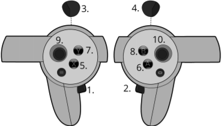

# Almond Axol Web

The browser front-ends for the Almond Axol robot. This directory lives inside the main `axol` repo (it was previously the standalone `axol-vr` repo) and builds two surfaces from one app:

- **VR interface** (`/vr`) — WebXR teleoperation. Streams hand/elbow pose from a Meta Quest headset to the Almond Axol SDK over WebSocket. Deployed to Vercel at [axol.almond.bot](https://axol.almond.bot).
- **Control panel** (`/control`) — browser UI for driving the robot (connect, teleop, gravity comp, collect data, run policy). Served by `axol serve`.

The base path `/` redirects by device: headset browsers go to `/vr`, everything else to `/control`.

> Docs: [Web Control Panel](https://almond.bot/docs/guides/control-panel) · [VR Interface](https://almond.bot/docs/guides/vr-interface). The `serve` backend (FastAPI) that the control panel talks to lives in `almond_axol/serve/`.

## Structure

```
web/
├── app/                        # Vite + React app — both /vr and /control routes
│   ├── src/routes/VrApp.tsx        # WebXR teleop interface
│   ├── src/routes/ControlPanel.tsx # control panel UI
│   └── dist/                       # build output — served by `axol serve` and Vercel
└── packages/
    └── axol-vr-client/         # Reusable R3F components and hooks
```

## Packages

### `@almond/axol-vr-client`

React components and hooks for connecting to the Almond Axol SDK WebSocket server from inside an XR session.

**Exports**

| Export | Description |
|---|---|
| `AxolVRClient` | R3F component — reads XR input sources each frame and streams pose data over WebSocket |
| `useAxolVRClient` | Hook — manages WebSocket lifecycle (connect, disconnect, auto-retry) |
| `useAxolVideo` | Hook — negotiates a WebRTC connection over the same WebSocket and returns the camera video tracks streamed by the server (overhead / wrist cams), labelled by camera name |
| `AxolState` | Enum — `Teleop`, `DataCollection`, `Recording`, `Saving`, `Error` |
| `AxolConnectionStatus` | Enum — `Idle`, `Connecting`, `Open`, `Error`, `Failed` |
| `AxolPoseData` | Type — shape of each frame sent over the WebSocket |

**`AxolVRClient` props**

| Prop | Type | Description |
|---|---|---|
| `wsRef` | `RefObject<WebSocket \| null>` | WebSocket ref from `useAxolVRClient` |
| `onStateChange` | `(state: AxolState) => void` | Fires when the controller state machine transitions |
| `onPendingRecording` | `(pendingAt: number \| null) => void` | Fires with a timestamp when a 3-second recording countdown begins; `null` when cancelled or resolved |
| `onExit` | `() => void` | Fires when the Y button exits the XR session |

**`useAxolVRClient` params**

```ts
useAxolVRClient(hostname: string, port = 8000, maxRetries = 3, retryMs = 1000)
// returns: { status, connect, disconnect, wsRef }
```

**Frame data (`AxolPoseData`)**

Each frame sends a JSON message over the WebSocket:

```ts
{
  l_ee:    { position: { x, y, z }, quaternion: { x, y, z, w } }  // left controller
  r_ee:    { position: { x, y, z }, quaternion: { x, y, z, w } }  // right controller
  l_elbow: { x, y, z }
  r_elbow: { x, y, z }
  l_lock:  boolean   // left grip button state (True = pressed); rising edge of both together enables tracking, either alone disables it
  r_lock:  boolean   // right grip button state (True = pressed); see l_lock
  l_grip:  number    // left grip (0 = fully gripped, 1 = open)
  r_grip:  number    // right grip
  reset:   boolean   // true on the frame X was pressed
  state:   "teleop" | "data_collection" | "recording"  // client-driven; "saving" is server-pushed via feedback message
}
```

## Controller bindings



| # | Button | Action |
|---|---|---|
| 1 | Left grip | Press both grips (1 + 2) together to **enable** arm tracking; press either alone to **disable** it (toggle, not hold) |
| 2 | Right grip | See above |
| 3 | Left trigger | Actuate left gripper; while tracking is disengaged, point at a camera screen and hold to move it |
| 4 | Right trigger | Actuate right gripper; while tracking is disengaged, point at a camera screen and hold to move it |
| 5 | Left **X** | Reset pose; cancels recording countdown; exits Recording → DataCollection |
| 7 | Left **Y** | Exit XR session |
| 6 | Right **A** | Start recording (3-second countdown); stop immediately if already recording; cancels countdown if pressed during it |
| 8 | Right **B** | Toggle between Teleop and DataCollection (disabled while recording or countdown) |
| — | Right thumbstick | Flick = latched camera-view picker (up = overhead, left/right = wrist fullscreen, down = split; re-flick = back to default passthrough + PiPs). Click = re-anchor the screens to the current gaze |

## State machine

```
Teleop ──[B]──► DataCollection ──[A]──► (countdown 3s) ──► Recording
   ▲                 ▲                                          │
   └────────[B]──────┘                                   [A or X]
                                                               │
                                                          (server push)
                                                               │
                                                             Saving
                                                               │
                                                          (save done)
                                                               │
                                                         DataCollection
```

During the 3-second countdown the state sent to the server remains `DataCollection`. Once the countdown completes it transitions to `Recording`.

The `Saving` state is **server-driven**: the Python SDK broadcasts `{"type": "state", "value": "saving"}` over the WebSocket immediately when recording stops, then `{"type": "state", "value": "data_collection"}` once `save_episode()` completes. While in `Saving`, all A/B/X button actions except Y (exit) are blocked.

The `Error` state is also **server-driven**: broadcasting `{"type": "state", "value": "error"}` displays an error indicator in the headset UI and blocks all recording controls.

## App

The `app/` package is a Vite + React app that serves both the WebXR teleop interface (`/vr`, wrapping the `axol-vr-client` library) and the control panel (`/control`). The two routes are lazy-loaded so opening the control panel doesn't pull in the heavy three.js / XR bundle.

**Dev**

```bash
npm install
npm run dev --workspace=app
```

- **VR**: open the printed localhost URL on your Quest browser, enter the hostname of the machine running the Almond Axol SDK, press **Connect**, then **Start** to enter the AR session.
- **Control panel**: open `/control` in a normal browser. It talks to the `axol serve` API (default `https://localhost:8001`).

**Build**

```bash
npm run build --workspace=packages/axol-vr-client   # client package first
npm run build --workspace=app                        # → app/dist/
```

The built `app/dist/` is served two ways: by Vercel (the hosted VR app) and by `axol serve` locally (which hosts both routes from the same bundle).

## Deployment

The app is deployed on Vercel. `vercel.json` builds the client package first so it is available as a local workspace dependency:

```json
{
  "buildCommand": "npm run build --workspace=packages/axol-vr-client && npm run build --workspace=app",
  "outputDirectory": "app/dist",
  "installCommand": "rm -f package-lock.json && npm install"
}
```

The `installCommand` removes any macOS-generated lock file to avoid missing Linux rollup binaries on the Vercel build machine.

## Python SDK

The Almond Axol SDK receives frames from the headset and can push state feedback back. The relevant models live in `almond_axol/vr/models.py`:

```python
class VRState(str, Enum):
    TELEOP = "teleop"
    DATA_COLLECTION = "data_collection"
    RECORDING = "recording"
    SAVING = "saving"          # server-pushed only; blocks recording controls
    ERROR = "error"            # server-pushed only; shows error indicator in headset UI

class VRFrame(BaseModel):     # headset → server (every XR frame)
    l_ee: VRPose
    r_ee: VRPose
    l_elbow: VRPosition
    r_elbow: VRPosition
    l_lock: bool
    r_lock: bool
    l_grip: float
    r_grip: float
    reset: bool
    state: VRState             # one of TELEOP / DATA_COLLECTION / RECORDING
```

**Server → headset feedback**

The server can push a state override to all connected headsets at any time:

```json
{ "type": "state", "value": "saving" }
```

Use `AxolVRTeleop.send_feedback_state(VRState.SAVING)` / `send_feedback_state(VRState.DATA_COLLECTION)` to block and unblock recording controls on the headset while an episode is being written to disk.

The server also pushes `{ "type": "tracking", "value": true|false }` whenever the engage toggle changes; the headset uses it to only allow repositioning the camera screens while the robot isn't being controlled.

**Camera video (WebRTC)**

When the server has video sources registered (`VRServer.set_video_sources`, see `almond_axol/vr/video.py`), the headset negotiates a WebRTC connection over the same WebSocket: it sends `{ "type": "webrtc-request" }`, the server replies with `{ "type": "webrtc-offer", "sdp": ..., "tracks": { mid: cameraName } }`, and the client answers with `{ "type": "webrtc-answer", "sdp": ... }`. The `useAxolVideo` hook implements the client side and returns the labelled video tracks. A stereo overhead arrives as the two tracks `overhead_left` / `overhead_right`, rendered per-lens.
